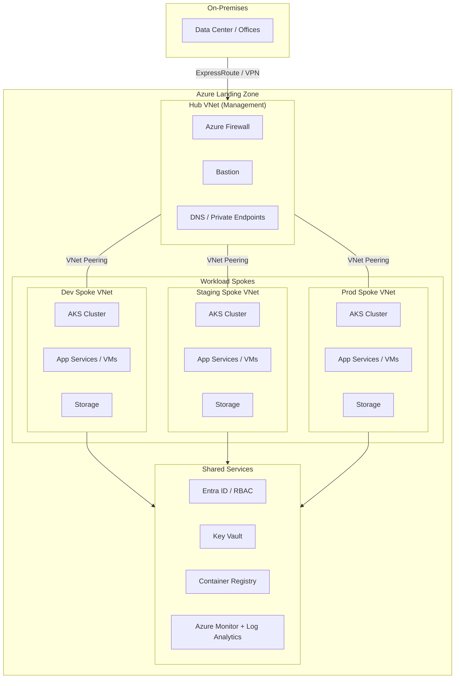
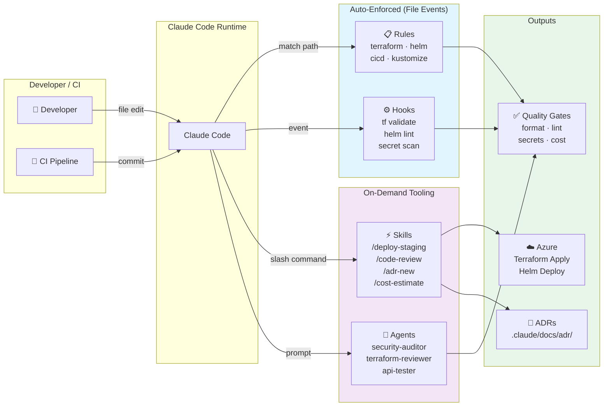

# Project

This examples project is about an Azure Migration - Infrastructure as Code and deployment automation for a customer's cloud infrastructure migration to Azure.

## Getting Started with Claude

This project is enhanced with **Claude Code integration** — AI-assisted infrastructure automation, code review, security auditing, and cost optimization. No configuration needed; automation and agents are ready to use immediately.

### Quick Reference: Available Commands & Agents

| I want to… | How | Auto-triggered? |
|---|---|---|
| **Deploy to staging** | `/deploy-staging` | No — on demand |
| **Review changed code** | `/code-review` | No — on demand |
| **Create an ADR** | `/adr-new` (describe decision) | No — on demand |
| **Check infrastructure drift** | `/drift-check` | No — on demand |
| **Estimate cost impact** | `/cost-estimate` | No — on demand |
| **Security audit** | `security-auditor: review terraform/` | No — on demand |
| **Terraform best practices** | `terraform-reviewer: review this module` | No — on demand |
| **API functional test** | `api-tester: test /health and /api/users endpoints` | No — on demand |
| **Cost optimization** | `cost-advisor: analyze current AKS sizing` | No — on demand |
| Validate `.tf` files on save | — | ✅ Auto |
| Lint Helm charts on edit | — | ✅ Auto |
| Validate kustomize on edit | — | ✅ Auto |
| Scan for secrets before commit | — | ✅ Auto |
| Remind about ADRs before push | — | ✅ Auto (warning) |

### Architecture Overview

#### Azure Target Architecture

Hub-and-spoke landing zone with environment separation and shared services for identity, networking, and observability.



#### Claude Code IaC Workflow

How Claude integrates into the infrastructure-as-code development and deployment cycle.



### How to use

**Skills** (slash commands) are typed in Claude Code:
```
/deploy-staging
/code-review
/adr-new
```

**Agents** are invoked by mentioning them in a natural-language prompt:
```
security-auditor: Review the Azure resource definitions for security vulnerabilities.
terraform-reviewer: Check the new modules for naming conventions and state configuration.
api-tester: Run health checks on the staging API after deployment.
cost-advisor: Analyze the new AKS configuration for cost optimization opportunities.
```

**Rules** are applied automatically — Claude enforces:
- ✅ Terraform: variables (no hardcoding), required tags, module pinning, OIDC auth
- ✅ Helm: appVersion sync, pinned image tags, resource limits
- ✅ CI/CD: no secrets in env vars, action version pinning, OIDC credentials
- ✅ Kustomize: strategic merges, image transformers, resource constraints

No prompt needed — rules are injected when Claude edits matching files.

### Key files

- **CLAUDE.md** — conventions, ADR guidelines, architecture decision rules
- **.claude/rules/** — auto-enforced Terraform, Helm, CI/CD, Kustomize standards
- **.claude/skills/** — reusable `/deploy-staging`, `/code-review`, `/adr-new`, `/cost-estimate`, `/drift-check`
- **.claude/agents/** — `security-auditor`, `api-tester`, `terraform-reviewer`, `cost-advisor`
- **.claude/hooks/** — auto-validate `.tf`, lint Helm, scan secrets, remind about ADRs
- **.claude/docs/adr/** — numbered architecture decisions (0001, 0002, etc.)

---

## Claude Setup

This project uses Claude Code for AI-assisted development and infrastructure automation. The `.claude/` directory contains configuration, skills, agents, and documentation.

### Directory Structure

```
.
├── CLAUDE.md                    # Essential project instructions (committed)
├── CLAUDE.local.md              # Personal overrides (gitignored)
├── .claude/
│   ├── settings.json            # Permissions, hooks, and MCP configs (committed)
│   ├── settings.local.json      # Personal permission overrides (gitignored)
│   ├── .mcp.json                # Dedicated MCP server definitions (committed)
│   ├── rules/                   # Modular, path-scoped instructions (committed)
│   ├── skills/                  # Reusable, auto-invoked workflows (committed)
│   │   ├── deploy-staging/      # Skill: /deploy-staging command
│   │   │   ├── SKILL.md         # Skill definition with frontmatter
│   │   │   ├── scripts/         # Helper scripts (e.g., deploy.sh)
│   │   │   └── templates/       # Static resources
│   │   └── code-review/         # Skill: /code-review command
│   │       └── SKILL.md         # Skill definition with frontmatter
│   ├── agents/                  # Specialized subagent personas (committed)
│   │   ├── security-auditor.md  # Security review agent
│   │   └── api-tester.md        # API testing agent
│   ├── docs/                    # Detailed reference documents (committed)
│   │   ├── architecture.md      # Azure target architecture
│   │   ├── project-context.md   # Customer background & stakeholders
│   │   ├── glossary.md          # Domain terms & vocabulary
│   │   ├── decisions.md         # ADR index and guidelines
│   │   └── adr/                 # Architecture Decision Records
│   │       ├── 0000-template.md # Blank ADR template
│   │       └── 0001-*.md        # Accepted/proposed ADRs
│   └── hooks/                   # Event-driven automation scripts (committed)
├── .claudeignore                # Files to exclude from Claude's context
└── ...                          # Source code and infrastructure files
```

### Configuration Files

- **CLAUDE.md**: Committed project instructions, guidelines, and requirements visible to all team members
- **CLAUDE.local.md**: Personal overrides and local-only instructions (gitignored)
- **.claude/settings.json**: Global permissions, hooks, and MCP server configurations
- **.claude/settings.local.json**: Personal permission overrides (gitignored)
- **.claude/.mcp.json**: Dedicated MCP server definitions for Claude integration
- **.claudeignore**: Patterns for files Claude should exclude from context

### Skills

Reusable workflows that can be invoked as slash commands:

- **/deploy-staging**: Automated deployment to staging environment
- **/code-review**: Automated code review workflow

### Agents

Specialized subagent personas for specific tasks:

- **security-auditor.md**: Security review and vulnerability assessment
- **api-tester.md**: API testing and integration validation

### Documentation & Rules

#### `.claude/docs/`

Reference documents Claude reads when relevant or when explicitly referenced in `CLAUDE.md`. Always-loaded is `CLAUDE.md` itself — keep it short and link to docs for detail.

Best for:
- Architecture overview and target state
- Domain glossary / customer-specific terminology
- Project context, stakeholders, background
- Migration scope and workstreams
- Key decisions / ADRs

Example files:
- `architecture.md` — Azure target architecture
- `project-context.md` — Customer background, stakeholders, migration goals
- `glossary.md` — Domain terms and customer-specific vocabulary
- `decisions.md` — Index and guidelines for ADRs
- `adr/` — Architecture Decision Records (see below)

#### `.claude/rules/`

Modular instructions scoped to specific file paths. Claude applies them automatically when working in the matched directory — no need to repeat conventions in every prompt.

Best for:
- Terraform / OpenTofu style conventions (`terraform/`)
- Helm chart authoring guidelines (`helm/`)
- CI/CD pipeline standards (`.github/workflows/`)
- Any folder with non-obvious project-specific rules

#### `.claude/hooks/`

Shell scripts triggered automatically by Claude Code lifecycle events (e.g. after a file is saved, before a commit, when a task completes). Hooks run outside the model — they are deterministic automation, not AI behavior.

Best for:
- Auto-formatting on save
- Running `terraform validate` after `.tf` changes
- Posting notifications when Claude finishes a task
- Enforcing pre-commit checks

#### `.claude/docs/adr/` — Architecture Decision Records

Numbered ADR files (`0000-template.md`, `0001-title.md`, etc.) capture significant architectural decisions with full context and consequences.

**When to write an ADR:**
- Decision changes or establishes overall architecture (networking, identity, storage, tenancy)
- Chooses between technologies or platforms
- Establishes a pattern all future code must follow
- Would be confusing to a new contributor without context
- Explicitly rejects a reasonable alternative

**When NOT to write one:**
- Implementation details or internal design
- Bug fixes
- Decisions obvious from reading the code

**How to create a new ADR:**
1. Copy `0000-template.md`
2. Rename to next available number: `0002-kebab-case-title.md`
3. Fill in Context (why), Decision (what), Consequences (impact)
4. Set status to `proposed` or `accepted`
5. Commit to version control

Claude Code auto-generates correctly numbered ADRs — just describe the decision and I'll create the file with proper structure and numbering.